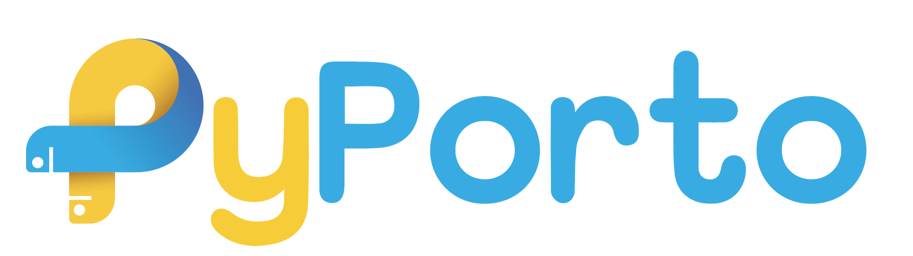

  

Python Porto is a vibrant and inclusive community of passionate individuals who share a common love for the Python programming language. Whether you're a seasoned Pythonista or just starting your coding journey, our group is the perfect place to connect, learn, and grow together.

Our mission is simple: to foster an environment where knowledge knows no bounds. We believe in the power of education and collaboration, and we're dedicated to providing a platform where members can freely exchange ideas, seek guidance, and contribute to the collective learning experience.

## Why join Python Porto?

- Knowledge Sharing: Python Porto is all about learning from one another. Our members come from diverse backgrounds, each bringing their unique perspectives and expertise to the table. Whether you want to dive into Python's core concepts, explore its vast libraries, or discuss best practices, you'll find a wealth of knowledge waiting for you.
- Networking Opportunities: Building connections in the tech industry is essential for personal and professional growth. Python Porto offers a supportive network of like-minded individuals where you can collaborate on projects, find mentors, or seek career advice.
- Events and Workshops: Stay up-to-date with the latest trends and developments in the Python ecosystem through our regular events and workshops. We host informative talks, hands-on coding sessions, and even hackathons to challenge your skills and creativity.
- Social Engagement: Beyond just code, Python Porto is a friendly and fun community. Engage in discussions, share memes, or participate in our social activities. We believe in creating an inclusive space where everyone feels welcome and valued.

## Social Networks

Join Python Porto on our various platforms:
- Facebook: [facebook.com/groups/pythonporto](https://www.facebook.com/groups/pythonporto)
- Twitter: [x.com/pyporto](https://x.com/pyporto)
- LinkedIn: [linkedin.com/groups/13592590/](https://www.linkedin.com/groups/13592590/)

## Core Team

This team makes Python in Porto possible.

> We are always looking for passionate community members to help us grow! If you would like to become part of the **PyPorto Core Team**, please drop us an email at [pyporto@sapo.pt](mailto:pyporto@sapo.pt). We look forward to hearing from you!

### Roman Imankulov

Lived in Porto for almost four years and works with Python for more than a decade. Loves Python and web development. In Python Porto acts as the main organizers, speaker on several events and a permanent resident of PyCoffee.

  
  
  
    

### ≀Paulo Portela

Paulo is a Senior Software Developer from adidas, and he is eager to help beginners in Python Porto to learn the language. Author and the main presenter of "Python 101" workshops. You can also find him on our PyCoffee events.

  
  
  
  

### Francisca Dias

Francisca is a Data Analyst, constantly eager to improve her skills in data analytics, with a focus on open-data and web development. She is the author, organizer and speaker of "Python for Data Science" workshops of Python Porto.

  
  
  

### Leonid Kholkine

All round coder and pursuing a Ph.D. in Data Science / Machine Learning by day. Organizes data science and tech initiatives by night.

  
  
  

## Learning Python

- Learning Python: [Index](python/Index.md)

## Other Communities

- <a href="https://portotechhub.com" target="_blank">Porto Tech Hub PTH</a>
- <a href="https://www.meetup.com/pt-br/datascienceportugal/" target="_blank">Data Science Portugal DSP</a>

